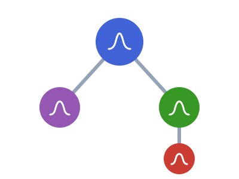

# ComposedDistributions 

<!-- badges:start -->
| **Documentation** | **Build Status** | **Code Quality** | **License & DOI** | **Downloads** |
|:-----------------:|:----------------:|:----------------:|:-----------------:|:-------------:|
| [](https://composeddistributions.epiaware.org/stable/) [](https://composeddistributions.epiaware.org/dev/) | [](https://github.com/EpiAware/ComposedDistributions.jl/actions/workflows/test.yaml) [](https://codecov.io/gh/EpiAware/ComposedDistributions.jl) [](https://github.com/EpiAware/ComposedDistributions.jl/actions/workflows/ad.yaml) | [](https://github.com/SciML/SciMLStyle) [](https://github.com/JuliaTesting/Aqua.jl) [](https://github.com/aviatesk/JET.jl) | [](https://opensource.org/licenses/MIT) | [](https://juliapkgstats.com/pkg/ComposedDistributions) [](https://juliapkgstats.com/pkg/ComposedDistributions) |

| ForwardDiff | ReverseDiff (tape) | Enzyme forward | Enzyme reverse | Mooncake reverse | Mooncake forward |
|:---:|:---:|:---:|:---:|:---:|:---:|
| [](https://app.codecov.io/gh/EpiAware/ComposedDistributions.jl?flags%5B0%5D=ad-forwarddiff) | [](https://app.codecov.io/gh/EpiAware/ComposedDistributions.jl?flags%5B0%5D=ad-reversediff) | [](https://app.codecov.io/gh/EpiAware/ComposedDistributions.jl?flags%5B0%5D=ad-enzyme-forward) | [](https://app.codecov.io/gh/EpiAware/ComposedDistributions.jl?flags%5B0%5D=ad-enzyme-reverse) | [](https://app.codecov.io/gh/EpiAware/ComposedDistributions.jl?flags%5B0%5D=ad-mooncake-reverse) | [](https://app.codecov.io/gh/EpiAware/ComposedDistributions.jl?flags%5B0%5D=ad-mooncake-forward) |
<!-- badges:end -->

A verb grammar for n-ary composition over any `Distributions.jl` distribution.

## Why ComposedDistributions?

- Compose delays into chains (`sequential`), independent branches (`parallel`),
  fixed-probability or racing one_of outcomes (`resolve` / `compete`) and
  data-selected disjunctions (`choose`), over any `UnivariateDistribution`.
- One object scores an observed record with `logpdf` and simulates one with
  `rand`, so a model is built once and used in both directions.
- Build a whole tree from a `NamedTuple`, a `Tables.jl` table, or a nested
  matrix with `compose`, and read its structure with `params_table`,
  `event_names`, `event`, and `event_tree`.
- Turn the parameter table into a nested prior with `build_priors`, and edit the
  tree with `update`, `prune`, and `splice`.
- Attach parameter uncertainty with `uncertain` (parameters that are themselves
  distributions, nestable): `rand` draws the marginal, and `update(tree,
  params)` collapses an uncertain leaf to its concrete template. Promote a
  whole tree to estimate its free parameters at once with `param_priors`.
- Hard-deps and re-exports `ConvolvedDistributions` (a chain collapses to a
  convolved total via `observed_distribution`), so its convolution and
  quadrature surface is reachable through this package alone.
- No censoring: this is the generic composition layer.

## Getting started

See [documentation](https://composeddistributions.epiaware.org/stable/) for a full walkthrough.

```julia
using ComposedDistributions, Distributions

# A two-step delay chain, then its parameter table and a default prior set.
tree = compose((onset_admit = [Gamma(2.0, 1.0), LogNormal(0.5, 0.4)],))
params_table(tree)
priors = build_priors(params_table(tree))

# A death-vs-discharge competition (the death branch probability is the CFR).
node = resolve(:death => (Gamma(1.5, 1.0), 0.3), :disch => Gamma(2.0, 1.5))
mean(node)
```

## Relationship to Distributions.jl

ComposedDistributions builds on Distributions.jl rather than replacing it.
Every leaf is a Distributions.jl `UnivariateDistribution`, and a composed object is itself a `Distribution`, so `logpdf`, `rand`, `mean`, `var` and the rest of the interface work unchanged.

| Aspect | Distributions.jl | ComposedDistributions |
|--------|------------------|-----------------------|
| **Scope** | one distribution | many delays wired into an event tree |
| **Question** | "what is this delay?" | "how do these events relate?" |
| **Builds on** | — | any Distributions.jl `UnivariateDistribution` as a leaf |
| **Adds** | — | `compose`, the five composers, a parameter table and structural edits |

Because a composed object is a `Distribution`, it also works with `truncated()` from Distributions.jl and drops into any code that expects a distribution.

## What packages work well with ComposedDistributions?

- [Distributions.jl](https://github.com/JuliaStats/Distributions.jl) supplies the leaf distributions and the interface a composed object implements.
- [ConvolvedDistributions.jl](https://github.com/EpiAware/ConvolvedDistributions.jl) is re-exported, so convolution (`convolved`, `convolve_series`, `difference`) and quadrature are reachable through ComposedDistributions alone.
- [Tables.jl](https://github.com/JuliaData/Tables.jl) sources build a composer through `compose`, and `params_table` returns a Tables.jl table.
- [Turing.jl](https://github.com/TuringLang/Turing.jl) and the wider probabilistic-programming ecosystem, where automatic-differentiation-friendly scoring lets a composed distribution drop into a Bayesian fit.

## Where to learn more

- Want to get started running code? See the [getting started guide](https://composeddistributions.epiaware.org/stable/getting-started/).
- Want the right verb by intent? See the [Concepts](https://composeddistributions.epiaware.org/stable/getting-started/concepts) page.
- Want to understand the API? See the [API reference](https://composeddistributions.epiaware.org/stable/lib/public).
- Want to chat about `ComposedDistributions`? Post on our [GitHub Discussions](https://github.com/EpiAware/ComposedDistributions.jl/discussions).
- Want to see the code? Check out our [GitHub repository](https://github.com/EpiAware/ComposedDistributions.jl).

## Contributing

We welcome contributions and new contributors! This package follows [ColPrac](https://github.com/SciML/ColPrac) and the [SciML style](https://github.com/SciML/SciMLStyle).

## Supporting and citing

If you would like to support ComposedDistributions, please star the repository — such metrics help secure future funding.

If you use ComposedDistributions in your work, please cite it:

```bibtex
@software{ComposedDistributions_jl,
  author       = {Sam Abbott and EpiAware contributors},
  title        = {ComposedDistributions.jl},
  year         = {2026},
  doi          = {10.5281/zenodo.XXXXXXX}, # replace once released
  url          = {https://github.com/EpiAware/ComposedDistributions.jl}
}
```

## Code of conduct

Please note that the ComposedDistributions project is released with a [Contributor Code of Conduct](https://github.com/EpiAware/.github/blob/main/CODE_OF_CONDUCT.md). By contributing, you agree to abide by its terms.
